# OI 回忆录 
这是一篇姗姗来迟的文章。  
本人坐标 AH，OI 生涯：2020.7.12~2026.7.2，大约 $6$ 年。  
这年，我初三。  
现在该转入正文了。  
## 起步阶段
四年级的我在一位小学老师 [ldy6314](https://www.luogu.com.cn/user/102450) 的指引下接触到编程。依靠当年我还算可以的数学水平，我在 3 个月的时间学完语法部分，达到市赛二等奖水平。当时，这纯粹只是一门兴趣，我也从没想到我会真正走上 OI 道路。  

在五年级，我打了第一场 ccf 举办的比赛（CSP-J 2021），当时我水平比较低，再加上 T1 挂了 $10$ 分，喜提二等奖。在这一年，我进入当地小机构继续学习 C++（毕竟那算不上 OI）。  

六年级，我成功通过 CSP-J2022 与 CSP-S2022 的复赛，准备冲 CSP-S 一等奖。然后因疫情原因我们小区被封了。整个 AH 的复赛都没了，伤心。    
靠着小学还能看的 whk 成绩，我爬进了当地一所强校。
## 竞赛生涯
六年级暑假，我去 ZJ 某校参加第一次 OI 集训。当时我还不懂要卷，觉得自己在 AH 的水平够了，比较自我满足，加上实际水平低下，一个星期只学会了一个莫队，而且还是普通版。呜呜呜我好菜。  
### 初一
这年，我同时参加 CSP-J2023 与 CSP-S2023，均通过初赛。  
J 组复赛，我最后一题写了 spfa，当时我以为 spfa 复杂度按 $O(m)$ 算就行了，只有极少数情形被卡，与实际出题人爆卡 spfa 形成鲜明对比。出场时，估分 $400-eps$。  
S 组当时我 30min 写了 T1，接着一眼秒了 T2 的 $35$ 分，但随即发现 T3 是无脑模拟题，就没写那 $35$ 分，狂冲 T3 2h，一直调不出来。当时我记错结束时间了，记早了半小时。在我以为还剩 10min 时切回 T2，在这 10min 内拿到 $50$ 分。后来才发现记错时间了。最后 30min 看了 T4 不会，转回 T3，还是做不出。出场时，估分 $150+eps$。   
后来发现某机构给我 CSP-J2023 T3 估了 $0$ 分，何意味？  
我看了压缩包里我的代码，看到这几行，气笑了。  
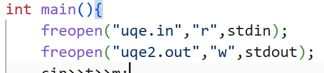  
$100\rightarrow0$。  
最终得分：J 组 $285$，S 组 $155$，双一等。获得 $6$ 级蓝钩。  

突然听说自己能去 NOIP？  
然后去了。在 WH。去玩了一趟。考了 $165$，又是一等奖。  
突然听说自己能去联合省选？  
然后去了。又在 WH。又去玩了一趟。  
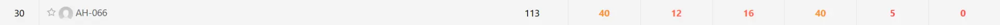

一个初一，感觉一直在 whk，也不知道自己学了什么 OI 知识。这个初一算是浪费掉了。
### 初二
暑假去 zr 的 C 班集训，感觉不错。在那个期间，我的刷题数远超之前任意时刻。学明白了部分知识点，感觉水平有所提升。   
不过开学后 whk 英语水平狂掉，语文英语互斥定律生效。在这种情况下，我不得不把精力更多地放在 whk 上。因此，oi 模拟赛我打了不到 $45\%$。  

这年我没报 CSP-J，只打 S 组。当时大概是不怎么会 greedy，然后 T3 就没做出来。由于我不会期望，T4 爆零。最终喜提 $265$ 分。获得 $7$ 级蓝钩。后来得知 [WaterM](https://www.luogu.com.cn/user/943083) 拿了 $300$ 分，有点玉玉。  

然后 NOIP 是真爆了。T1 我场上很快想到正解，但是不会证明我的 greedy idea 是对的，然后就写了 $60$ 分部分分，T2 由于暑假线性代数学废了，也只会 $60$ 分。T3 看了一个大样例，怎么全是 $1$？拿了 $4$ 分。T4 正常发挥，$32$ 分。后来得知我 T1 只有 $40$ 分，总分才 $136$。那年我们省只有 $58$ 个省一，线划在 $145$。那一刻，我明白，省选大抵是凉了。  

或许是因为一等没有女生吧，或许是因为觉得 2= 选手有翻盘机会吧，又或许是其他什么原因吧，这次省选允许 2= 选手参加！  
寒假加训了若干知识点，准备省选翻一点盘。  
奈何省选又炸了，$100+20+8+60+16+12=212$，似乎连 $3$ 倍线都没进。人家 Oken 初一就已经达到队线了，怎么办？  
这个省选，印象最深的大概还是这个吧：
> 我常常追忆过去。  
……   
我该在哪里停留？我问我自己。

见 [[省选联考 2025] 追忆](https://www.luogu.com.cn/problem/P11831)。  
后来把这一段话背会了，似乎并没有什么用。  
然后我把我 qq 上的生日改成了 2025.3.1，就是追忆的生日。

后来学校给我们 OIers 请了教练，结识了 [Rosaya](https://www.luogu.com.cn/user/191748)，感觉好强。  
后来重做 recall，感觉好水。我场上为什么做不出呢？哦我场上连 bitset 是什么都不知道。  
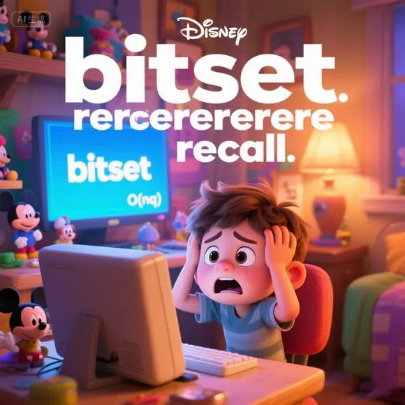
### 初三
如果说严格一点的话，我的竞赛生涯也许只有这一年。  
暑假去 zr B 班集训，进步还可以。  
把 AH 一位初三一年斩获 noiwc,apio,noi 三枚银牌的超级大神 [huangleyi0129](https://www.luogu.com.cn/user/443261) 的头像扔给 ai 改了一下，作为我现在的头像。希望这能给我的初三 OI 生涯带来一点好运。  
回去打 CSP-S 和 NOIP 联测。唯一一场能够 ak 的 CSP-S 场次我是 vp 的，伤心。不过，确实登顶了一次。没想到这也是最后一次。  

结果正赛 CSP-S 出得怪难的。花了 1.25h 创出 t1t2，用一个赛场上临时发明的非常菜的“递归树套字典树”水过 t3 大样例，最后剩 eps 分钟，打了 t4 的 $8$ 分做法。估分 $308$，感觉 noiwc 有了，高兴出场。  
回到家，看到洛谷犇犇，意识到自己倒闭了：
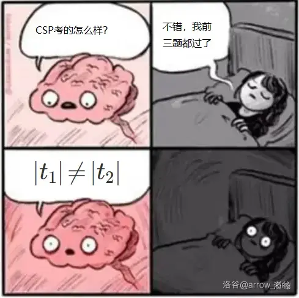  
t3 $100\rightarrow 0$。  
在重度抑郁的情况下度过两三天，忽然听说没卡 $|t1|\ne|t2|$，高兴坏了，查分，$100+80+95+8=283$。  
正赛卡常！太邪恶！  
感觉 noiwc 线就在这几分之间，去申诉，花了 $100$ 块钱。  
结果申诉结果在获奖名单发布后好几天才发布。所以 ccf 真的管了这些申诉吗？/fn  
AH rk16，初中生 rk1，还好吧。似乎擦在 noiwc 线边缘。  

noip2025 前停课加训了 1.5 个月。准备冲一把省队。  
然后 noip 被 [[NOIP2025] 清仓甩卖](https://www.luogu.com.cn/problem/P14636) 控了 3h+，写的 t3t4 暴力都挂完了，最后时刻还把写好的 t2 代码改 CE 了。最终~~喜提~~ $100$ 分。  
那天，我回到家，吃了饭，睡觉，睡到 17:00 才起床。起来看 t2 题解。怎么是一道唐题？为什么场上想不到呢？  

那一刻，我明白，手上剩的牌，或许只有 whk 了。我必须学会面对这个事实。  

得知 noiwc 报上名了，算是一点安慰。  
回学校补 whk。被 wfc 在 noip/whk 上二维偏序了。唉。  
不过这一段也算是开挂了，我之前就从来没考过年级前 $5$。  

寒假先卷了一段 oi，直到 noiwc 开始。  
noiwc2026 这段经历，参见[我的游记](https://www.luogu.com.cn/article/4yoxwbk8)。  
离银牌线差 $4$ 分，有点伤心，但我的目标就是不打铁，能拿金钩已经是 happy ending 了。  

省选前加训 Ynoi，全省我最唐。  
省选打了 $100+20+12+100+12+0=244$，释然了。  
把 impossible 打成 imposssible 了。  
我似乎 noip 打 $300$ 分都进不了队。  
然后滚回去补 whk 了。

## 后续

然后发生什么了呢？我在多位同学的影响下报了 ustc 的少创考试，本来打算去玩一趟的，没想到真过入围了？！  
早就厌倦了纯 whk 生活的我决定停课冲营一。然后营一拿了 $88+24=112$。  
然后营二就不停课了，周末去围观集训。  
然后营二怎么加试考了数学？！  
然后就拿下了。A 档，特控线上 ustc。  

当时拿到档的时候直接飘了，二模数学半做不做地考，英语作文玩梗（有一个 starmap，有一个 recollector，没有 recall 是因为动词用法不太会），然后中考二模数学考了 $138/150$，英语全班倒数前十五。遭报应了。  
在学校压力下停课去卷高考。进步还算快的。  
高考 $592>514$。  
然后剩余 $4$ 天闪击中考，中考 $705/750$，一般吧。  
总之是上岸了。

---

然后嘛。

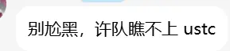

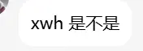

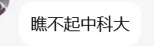

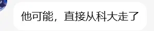

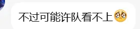

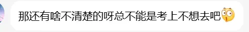

你别说，我确实纠结了很久。毕竟，奋斗了 $6$ 年，还没真正上战场就退役了的感觉并不好。  
但后来发现强基计划对 Ag 生的政策越来越不友好，加上我对我的 whk 水平没有任何自信，竞赛冲 Au 几乎不可能，大概率考不上 t/p，走了算了吧。  

## 鸣谢

- 感谢 ccf 组织的一系列比赛，虽然花了不少钱。  
- 感谢 ldy6314,aboluo2003,Rosaya 等老师的培养，感谢 clb 等老师提供暑假集训。  
- 感谢队长 [Purslane](https://www.luogu.com.cn/user/120947) 的指导，感谢 Purslane fans' club 和 Huangleyi0129 fans' club 的群友们同我交流。  
- 感谢我的 whk 老师、同学。  
- 感谢家人的支持。  
- 感谢我自己，感谢 OI。

## 后记

在退役之际，回首过往，发现每一场比赛都有能提升的地方，或许因为卡常丢掉的几十分，或许是粗心打错单词丢掉的分数，又或许是做出 recall 或者 sale 之类的。但此时此刻，我也并不对此感到遗憾——最多就是可惜吧。毕竟：
> 我们付出过，我们努力过，我们都对此拼搏过。

愿我们都能保持对算法竞赛的热爱，愿一切都好。

---

抓住和抓不住的照片 哪张更美  
去过和没去过的地方 哪里更远  
白鸟我的白鸟  
你要飞得更高不要回来  
若还想与我相见  
就来我的梦里边……

下图是我 OI 时代收集到的一些东西。

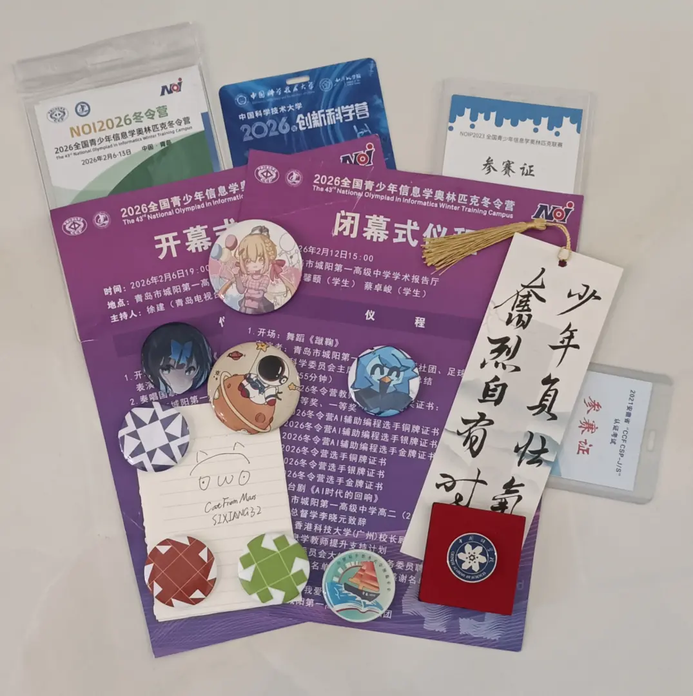

---

祝大家 NOI 都能和我的中考同一个分数。  
> 中考 $705$。

暂别。