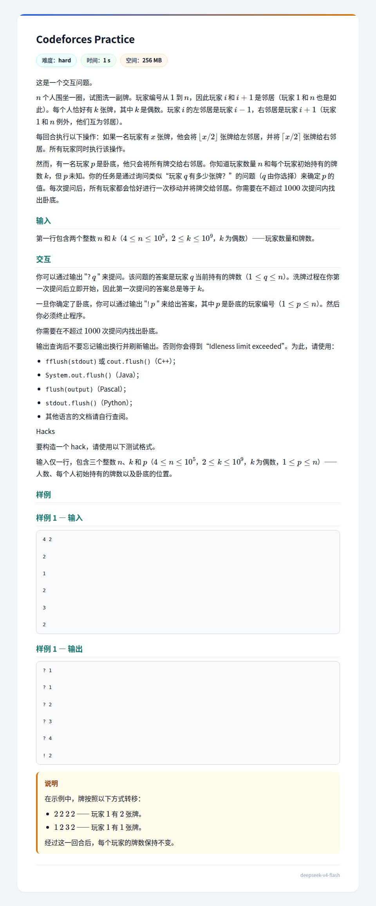

## 题面
??? note "题面"
    

## 题解
注：本题下标均在模 $n$ 意义下进行。

简化一下模型，考虑 $n\rightarrow+\infty$ 的情形。

考虑到卧底 $p$ 第一轮操作后会将其左边的东西变小，将右边的变大，然后注意到这个 $p+1$ 一定会让 $p+2$ 变大（因为 $p+1$ 这个位置显然大于偶数 $k$，而且向右给向上取整，显然会让 $p+2$ 变大），以此类推。  

根据上面的观察，我们发现，这个 $p$ 在 $m$ 次操作后只会影响 $[p-m,p+m]$ 区间的东西。  
然后我们尝试证明：在 $m$ 次操作后，无论多少次操作，$p+1$ 到 $p+m$ 位置均 $\ge k$，这个应该不难证明。  
然后有个加强的结论：$p+1$ 到 $p+m$ 位置均 $\gt k$，原因就是归纳，原 $p+1$ 至 $p+m$ 位置均 $\gt k$，所以仍然 $\gt k$。

类似的，有 $p-1$ 到 $p-m$ 位置均 $\lt k$，还有 $p$ 位置保持 $k$ 不变。  

现在考虑现实一点的问题：如果 $n$ 有限，如何在不超过 $3\sqrt n+O(1)$ 时间内完成？  
首先，仿照上面，同样观察得到卧底左侧偏小右侧偏大，可以先等大概 $160$ 招，保证影响区间长度至少 $320$，然后选定一个 $u=316$ 或者 $317$（要求 $u$ 不是 $n$ 因数），选定一个起点，每次跳 $u$ 步绕着转，直到发现一个值不为 $k$（不难证明两圈以内必能转到），花费不到 $640$，然后就锁定了卧底的范围（长度不超过 $2000$，具体视进行了几次扩张而定），注意到有可二分性，再用不到 $20$ 次即可。应该能过。