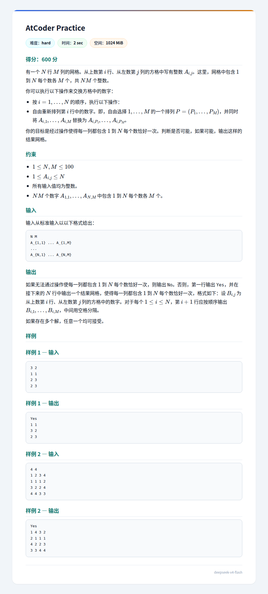

## 题面
??? note "题面"
    

## 题解
注意到数据范围只有 $100$，所以只要是多项式复杂度基本上随便过。  
注意到样例全是 Yes，手造几组也都是 Yes，感觉答案必为 Yes。  
我们考虑这样一个构造过程：想办法拼出第一列，再考虑子问题。  
一种策略是：每次找到出现行最少的一个数 $u$，优先满足 $u$，并忽略 $u$ 所在的这一行。  
为什么这不会中途倒闭？如果中途出现 $u,v$ 均只出现在同一行的情形，考虑上一行删掉的 $w$，说明 $u,v,w$ 被囊括在 $2$ 行内，依次向前推，发现初始有 $k+1$ 个数（出现了 $(k+1)M$ 次）被囊括在 $k$ 行 $kM$ 格以内，矛盾！  
故我们得到了有效的构造。复杂度反正不超 $O((\max\{n,m\})^4)$，能过。
