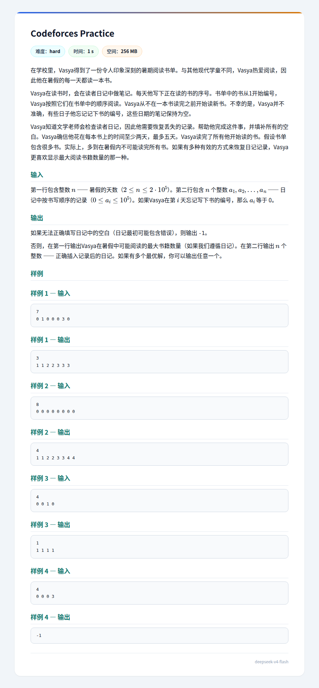

## 题面
??? note "题面"
    

## 题解
我们考虑维护 $f_{i,j}$ 表示只考虑前 $i$ 天的限制时（要求 $a_i\ne0$），能否使第 $i$ 天成为阅读第 $a_i$ 本书的第 $j$ 天。  
我们发现这个状态转移是非常好维护的（也就是说，可以快速判断能否从 $f_{i',j'}$ 转移到 $f_{i,j}$，其中 $(i',i)$ 中的所有 $a_k$ 均为 $0$，这大概就是，处理一下 $a_{i'}+1$ 到 $a_i-1$ 本书占用的天数范围（$2$ 倍到 $5$ 倍），然后就考虑 $a_{i'}$ 这本书读几天就好了，当然，要特殊处理一下段长超过 $5$，以及编号反减的情况），可以在 $O(n)$ 的时间转移到最后一个非零位置。  
判断 $-1$ 是简单的，就是直接考虑最后一个非零位置 $k$ 的状态，如果 $f_{k,1},f_{k,2},f_{k,3},f_{k,4},f_{k,5}$ 全为 `false` 就倒闭了，否则，如果只有 $f_{k,1}$ 是 `true` 且这恰好是第 $n$ 天也倒闭了。其他情况存在解。  
然后算最大值就是容易的了（就是，考虑最后一个非零位置，如果这个位置可以是第 $2,3,4,5$ 天的话，接下来两天一本即可（最后可能有一次是三天一本）），否则，再读一天这本书，接下来两天一本，考虑如何构造。类比最短路问题中输出路径的方式，我们记录下每个状态是由谁转移过来的（相当于记录转移），就知道了每个非零位置是第 $a_i$ 本书的第几天，然后填充 $0$ 的过程是容易的（仿照上面判断能否转移的方式即可）。  
综上，我们在 $O(n)$ 复杂度内完成了本题。