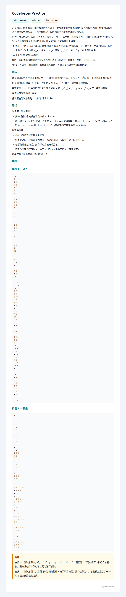

## 题面
??? 题面
    
## 题解
首先断言答案，记 $s_i$ 表示深度为 $i$ 的结点数，并设 $s_i$ 的最大值为 $k$。那么，如果下面条件成立则答案为 $k$，否则为 $k+1$。

- 对于任何满足 $s_u=k$ 的 $u$，所有深度为 $u$ 的结点不全为兄弟关系。

最小性显然（因为同层点不能在一次操作中被处理），接下来我们考虑构造。  
记答案为 $m$，我们先开 $m$ 个 `vector`，然后按照深度从浅到深构造。  
首先将根节点随便丢进一个 `vector`。  
然后，对于某一层 $d_v=w$ 的构造方案是：   
设集合 $S$ 为第 $v-1$ 层中所有非叶子节点的集合。  
维护集合 $T$，初始时是第 $v$ 层所有结点。  
然后每当发现 $T$ 中有两点 $g,h$ 互为兄弟关系，找出一个不含 $S$ 中任意元素且不含第 $v$ 层元素的 `vector`（这可以轻松预处理），把 $g$ 丢进这个 `vector`，并把 $g$ 移出 $T$。  
最后会发现：$T$ 中剩下的结点和 $S$ 中结点一一对应。这时的构造方案是：如果 $|S|>1$，随便找一个全错排即可。如果 $|S|=1$，把 $T$ 中这个元素丢进一个不含 $S$ 中元素且不含第 $v$ 层元素的 `vector` 即可。  

为什么必然存在呢？如果 $|S|=1$，则有 $m>s_v$，则 $v$ 层其他元素只占了至多 $m-2$ 个 `vector`，$S$ 中这个元素占一个，肯定还有一个。  

综上，我们得到了一个合理的构造。具体实现是简单的，复杂度可以做到 $O(\sum n)$，可以通过本题。