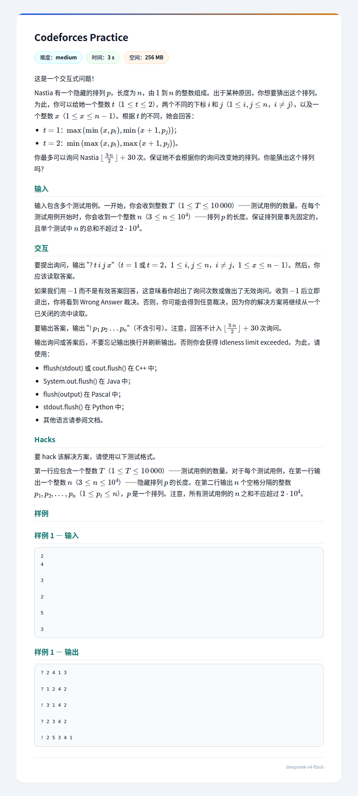

## 题面
??? 题面
    
## 题解
首先，注意到如果我知道 $p_m=k$，还知道哪些数 $\gt k$ 哪些数 $\lt k$ 就可以在 $n$ 次操作内得出所有值。  
这个就是：对于一个 $h$，如果我知道 $p_h\gt k$，那我取 $t=1,x=n-1,i=m,j=h$，询问结果就是 $p_h$，如果 $p_h\lt k$ 同理。  
然后我们如何快速得到一个 $p_m$ 呢？只需随便选一个 $r\ne m$，询问 $t=1,i=r,j=m$，得到的结果 $\le x$ 说明 $p_m\le x$，否则 $p_m\gt x$（这里，$p_r$ 无论大小，$\min(p_r,x)$ 均 $\le x$，不会影响整体是否 $\le x$），可以在 $\log_2n+O(1)$ 次询问内二分得到。  
然后就是在 $\frac n2+O(1)$ 询问内确定哪些数 $\gt k$ 了。

然后笔者想到这就卡住了。但随即有一个补救方案：  

二分出 $p_m=k$ 后，不妨设 $p_m\le \frac n2$（另一侧同理），那么我随便找出不同于 $m$ 的 $x,y$，应该有至少 $\frac16$ 的概率 $p_x,p_y$ 都大于 $k$（这是因为 $h\ge2$ 时 $C_h^2\ge\frac14 C_{2h-1}^2$），所以这一轮我用 $\frac n2$ 次询问得到了期望至少 $\frac14$ 个大于 $k$ 的数，然后用上面的方案确定出它们的值。如果引入随机化，得到数的最大值的期望是 $n-O(1)$，且应当在 $n-4$ 附近，极小概率小于 $n-6$（而且我刚刚的放缩是非常松的，这是因为 $p_m$ 接近 $\frac n2$ 概率才会逼近 $\frac14$，而此时只有大概 $\frac n2$ 个大于 $k$ 的数，在这种情况下这个最大值在 $n-2$ 附近）。  

这是一个非常有利的条件！我可以利用这个数 $p_u=v$，$n-v=O(1)$，对于剩下的数，我每个执行 $t=2,x=1,i=d,j=u$ 就得到了 $\min(p_d,v)$。这样就只剩下 $O(1)$ 个数不对了。这时我们发现谁是 $1$ 已经被找出来了，用 $p_z=1$ 来确定这 $O(1)$ 个大于 $v$ 的数（我之前找到了谁等于 $v$，剩的大于 $v$，设 $p_r=1$，这个就 $t=2,x=1,i=r,j=s$ 就得到 $p_s$ 了）就好了。  

综上，二分是 $\log_2n$ 次，一轮扫描 $\frac n2$，确定每个数 $n+O(1)$，我们完成了题目要求。由于 $30$ 明显大于 $\log_2n$，对随机化的容错空间较大，应当能够通过。