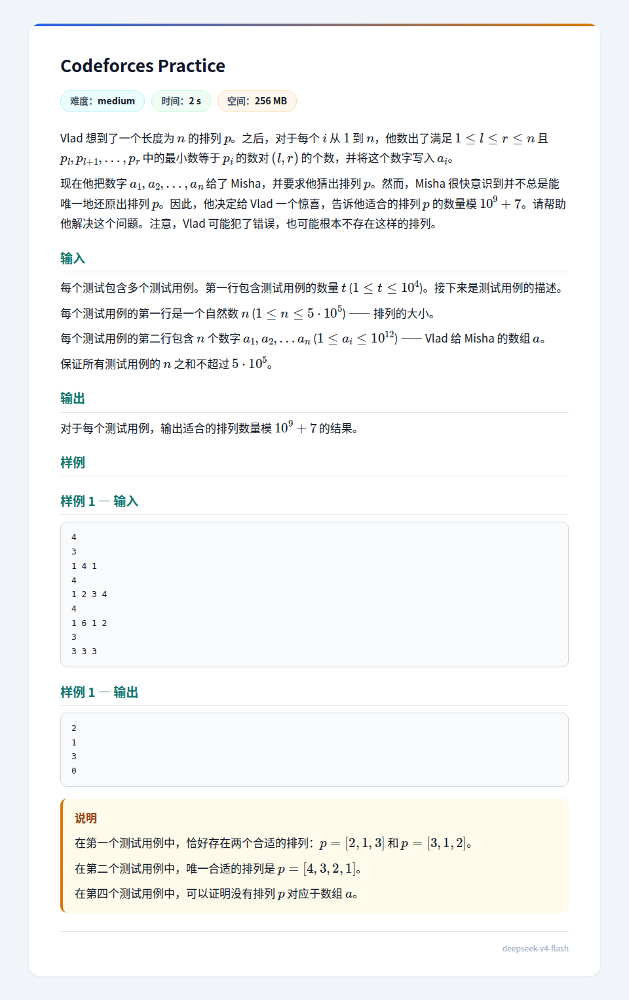

## 题面
??? 题面
    
## 题解
这个题一眼有一个想法：注意到有相同小根笛卡尔树的排列 $p$ 得到的 $a$ 是相同的，而且不同笛卡尔树得到的序列必然是不同的，考虑按照 $a$ 建出笛卡尔树，然后在笛卡尔树上计数。  
后一部分是简单的，就是根选最小值，左右子树选定值域，相乘即可，形式化地，设 $u_i，v_i$ 为 $i$ 为根的子树的左子树和右子树的大小，答案就是 $\prod C_{u_i+v_i}^{v_i}$，模数为素数，预处理阶乘的逆元即可，复杂度 $O(n\log n)$。  
我认为难点在前一半，就是我确实可以 $O(len)$ 的复杂度根据 $a$ 找到长为 $len$ 的位置的最小值，然后分治，但最坏复杂度 $O(n^2)$，无法通过。  
考虑优化。