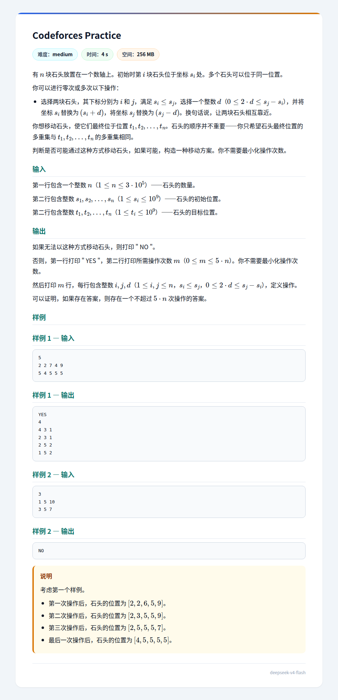

## 题面
??? 题面
    
## 题解
注意到一种做法：把 $s,t$ 从小到大排序，记  $c_i=t_i-s_i$。显然一个要求是 $\sum c_i=0$。  
然后发现操作稍微弱化一下，就是找 $c_i\gt0,c_j\lt0,i\lt j$，把 $c_i$ 加一，$c_j$ 减一。
然后从前往后扫，每当遇到一个 $c_k\lt0$（这时要求 $c_1$ 到 $c_{k-1}$ 均非负），我们找出第一个 $c_u\gt0$，让 $s_u$ 和 $s_k$ 靠近使得 $c_u$ 和 $c_k$ 中一个变成 $0$，重复执行至 $c_k=0$。如果找不到 $u$ 就认为无解。  
这个做法对解的存在性判断是正确的，为什么呢？  
因为，如果出现上述情况，说明初始时 $\sum_{i=1}^kc_i\lt0$，但是 $1\sim k$ 内的操作不改变这个值，$1\sim k$ 和 $k+1\sim n$ 之间的操作只会减小这个值，不可能变为 $0$，所以上述方法判断的无解必然实际无解。  
上述方法构造出的有解当然有解。  
然后是操作次数证明。注意到一次操作一定会产生至少一个 $0$，因此至多 $n$ 次操作。  
综上，可以通过本题。