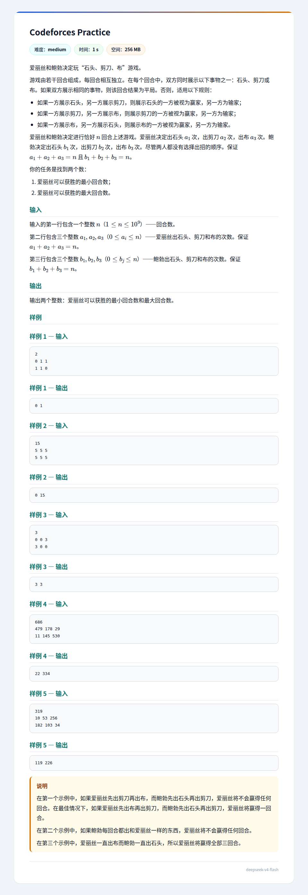

## 题面
??? 题面
    
## 题解
直接计数较难，考虑网络流，采用费用流模型比较容易刻画。  
记原点为 $S$，汇点为 $T$，再开 $6$ 个点 $A_1,A_2,A_3,B_1,B_2,B_3$。  
然后连边：  

- $S$ 向 $A_1$ 连额度 $a_1$，费用 $0$ 的边。
- $S$ 向 $A_2$ 连额度 $a_2$，费用 $0$ 的边。
- $S$ 向 $A_3$ 连额度 $a_3$，费用 $0$ 的边。
- $A_1$ 向 $B_1$ 连额度不限，费用为 $0$ 的边（即石头对石头）。
- $A_1$ 向 $B_2$ 连额度不限，费用为 $1$ 的边（即石头对剪刀）。
- $A_1$ 向 $B_3$ 连额度不限，费用为 $0$ 的边（即石头对布）。
- $A_2$ 向 $B_1$ 连额度不限，费用为 $0$ 的边（即剪刀对石头）。
- $A_2$ 向 $B_2$ 连额度不限，费用为 $0$ 的边（即剪刀对剪刀）。
- $A_2$ 向 $B_3$ 连额度不限，费用为 $1$ 的边（即剪刀对布）。
- $A_3$ 向 $B_1$ 连额度不限，费用为 $1$ 的边（即布对石头）。
- $A_3$ 向 $B_2$ 连额度不限，费用为 $0$ 的边（即布对剪刀）。
- $A_3$ 向 $B_3$ 连额度不限，费用为 $0$ 的边（即布对布）。
- $B_1$ 向 $T$ 连额度 $a_1$，费用 $0$ 的边。
- $B_2$ 向 $T$ 连额度 $a_2$，费用 $0$ 的边。
- $B_3$ 向 $T$ 连额度 $a_3$，费用 $0$ 的边。

然后跑最小费用最大流就是最少赢几次，最大费用最大流就是最多赢几次。   
复杂度的话，是 $8$ 个点，$15$ 条边的费用流，显然可过。