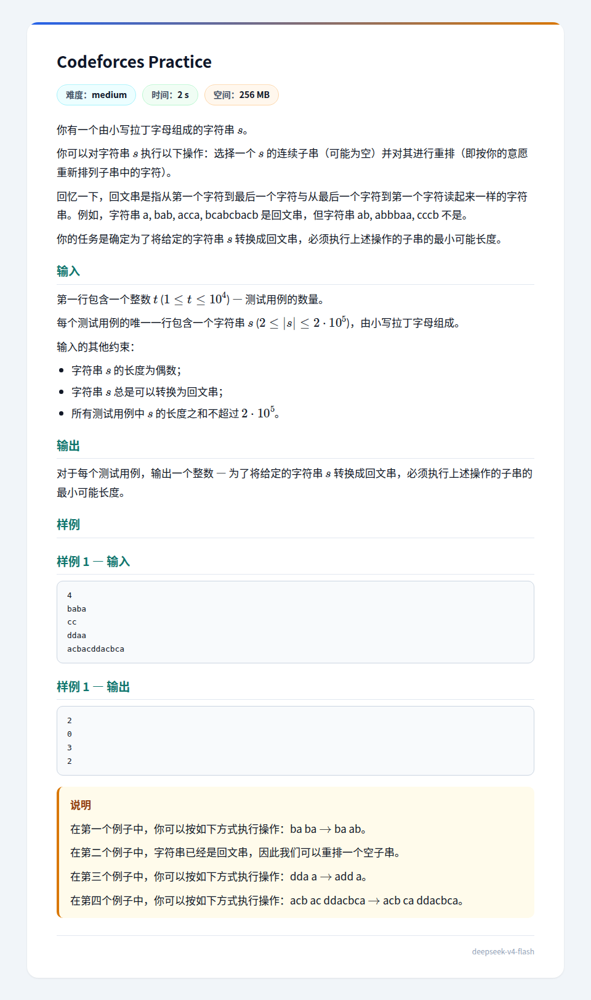

## 题面
??? 题面
    
## 题解
让字符串从 $1$ 开始标号。  
考虑到如果对称的两个位置字符不同，必然要修改其中一个。  
我们设这些对称的不同字符为 $(a_1,n+1-a_1),(a_2,n+1-a_2),\cdots,(a_k,n+1-a_k)$，其中 $1\le a_1\lt a_2\lt\cdots\lt a_k\le n/2$。  
那么注意到为满足 $(a_1,n+1-a_1)$ 和 $(a_k,n+1-a_k)$，最少要动 $(a_k-a_1+1)$ 的长度。   
但这个长度只是下限，并不是什么时候都能满足的。具体地，注意到如果某字符 $\mathrm{ch}$ 在前缀 $s_1s_2\cdots s_h$（其中 $h\lt n/2$）中出现次数超过该字符在整个串中出现次数的一半，那么这个修改的区间显然应该包含 $[h,n/2+1]$，对于后缀同理。  
这样，我们就能通过这一条得到哪些值必须在其中，哪些不必（会得到形如 $[l,r],l\le n/2\lt r$ 必须在被改区间中这样的限制），然后再考虑选 $a_1$ 还是 $n+1-a_1$，选 $a_k$ 还是 $n+1-a_k$ 即可。  
不难证明选这个区间必然能构造，就是考虑最左端和最右端的情况，如果都不在区间内必然是两者相等，如果恰有一个在修改区间里就把这个位置放一个对称的（由于考虑到了字符出现次数问题，$\mathrm{ch}$ 在固定的那一侧出现次数不会超过可修改的区间中出现次数，我们要的这个字符必然存在），如果都在那随便放两个一样的就好（因为出现了这种情形必然是整个中间部分全要改）。然后忽略这两个位置，做子问题。

综上，我们得到了一个复杂度线性的做法。可过。