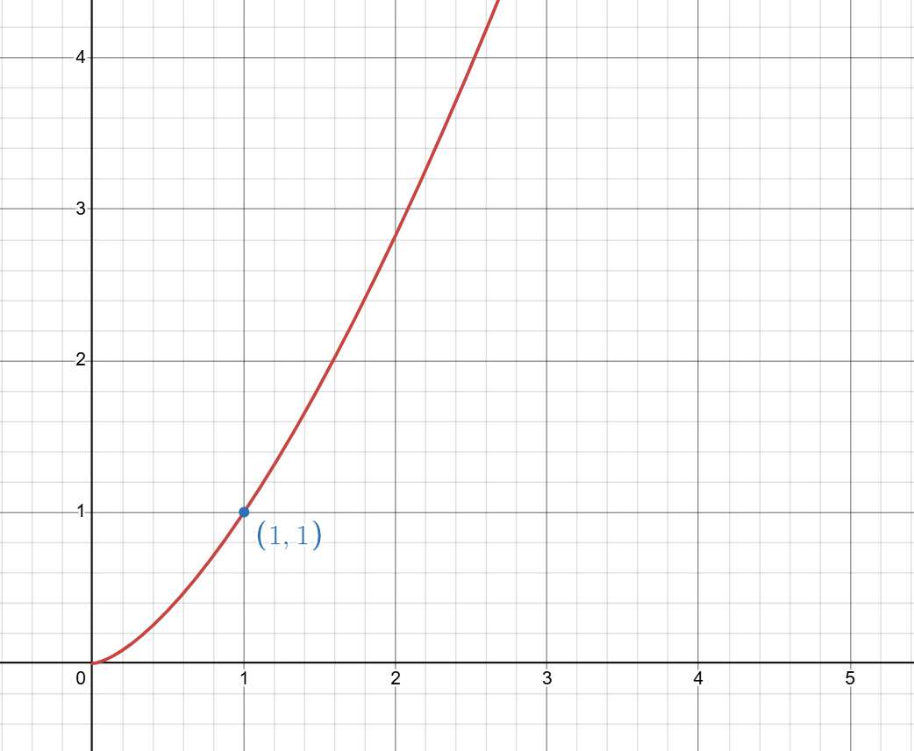
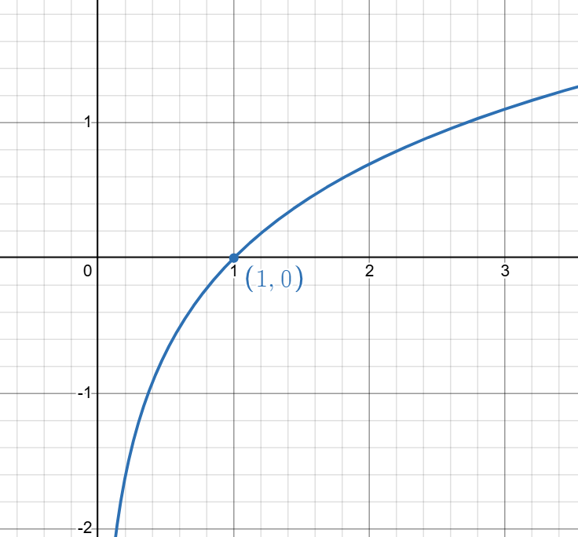
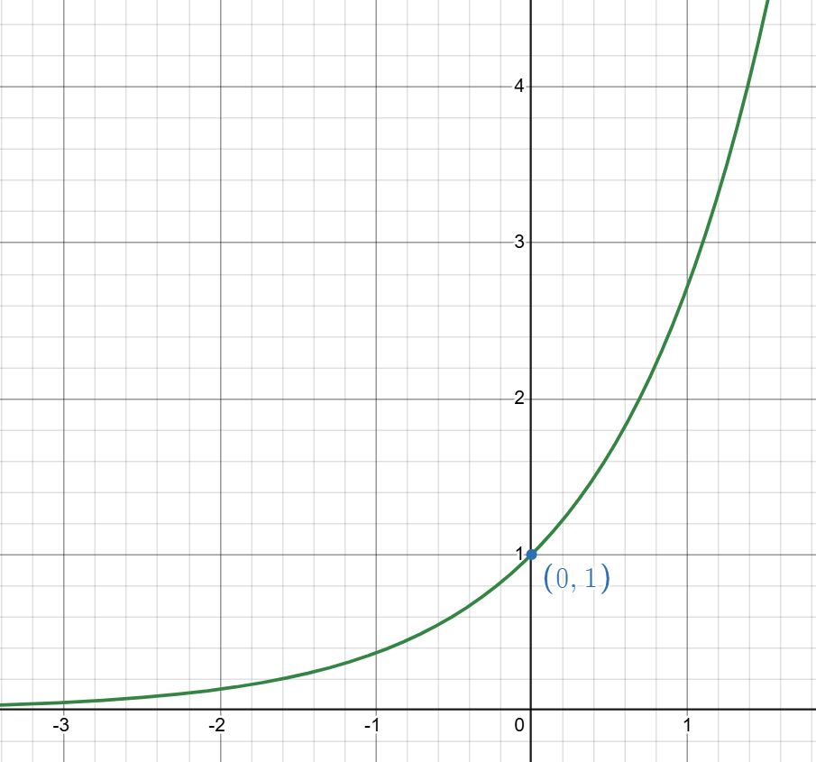
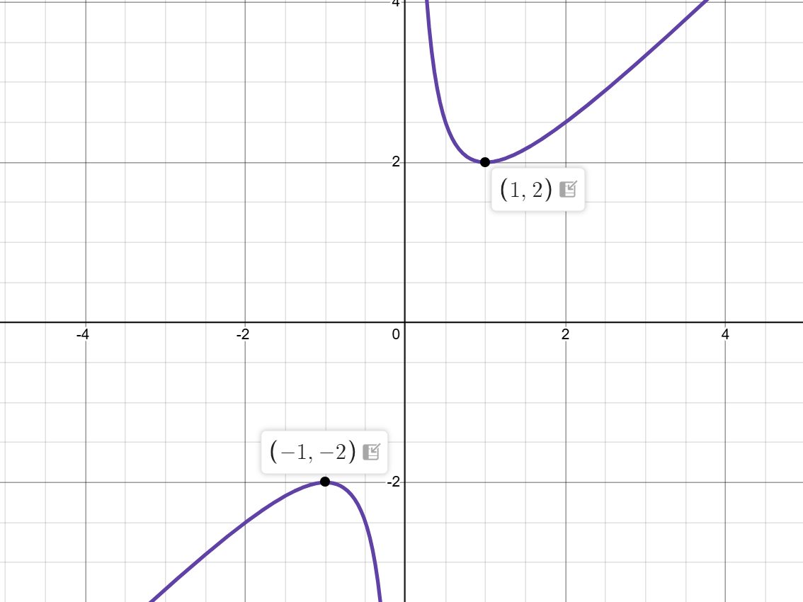
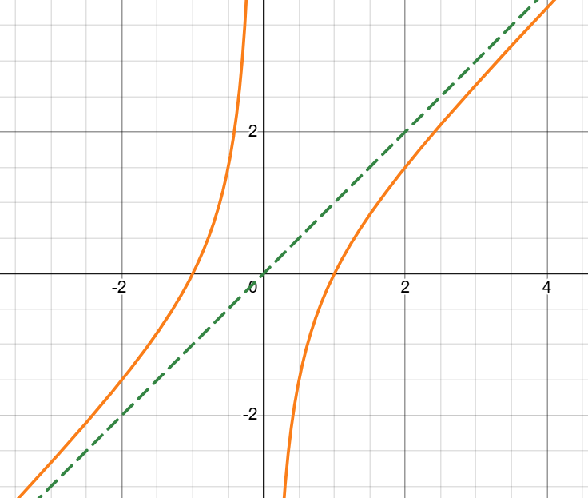

## 常函数
最简单的一类函数，$f(x)=C$。
## 指数函数
形如 $f(x)=u^x$ 的函数是指数函数（$u>0,u\ne 1$）。  
定义域：$\mathbb R$。  
值域：$(0,+\infty)$。  
单调性：$u\in(0,1)$ 时在 $\mathbb R$ 上单调减，$u>1$ 时在 $\mathbb R$ 上单调增。    
恒过定点 $(0,1)$。

## 对数函数
???+ note "什么是对数"
    我们都学过指数，对数就是指数的逆运算。  
    具体地，如果 $a>0$ 且 $a\neq1$，$b>0$，必然存在 $c$ 使得 $a^c=b$，我们把这个 $c$ 记作 $\log_ab$。  
    特别的，如果底数是 $e$，叫做自然对数，记作 $\ln$；如果底数是 $10$，叫做常用对数，记作 $\lg$。  
    对数有以下基础运算法则：

    - $\log_ab+\log_ac=\log_abc$。
    - $k\log_ab=\log_ab^k$。
    - $\log_ab\log_bc=\log_ac$。
    - $\log_ab=\frac{\log_cb}{\log_ca}$。

    $e$ 是什么？参见大学数学 - 数学分析 B1 - 极限。

形如 $f(x)=\log_a x$（$a>0$，且 $a\neq 1$）的函数是对数函数。  
定义域：$(0,+\infty)$。  
值域：$\mathbb R$。  
单调性：$a\in(0,1)$ 时在 $(0,+\infty)$ 上单调减，$a>1$ 时在 $(0,+\infty)$ 上单调增。  
恒过定点 $(1,0)$。

## 幂函数
形如 $f(x)=x^\alpha$（$\alpha$ 为常数）的函数是幂函数。  
定义域：随 $\alpha$ 的取值而变化（例如 $\alpha$ 为正整数时定义域为 $\mathbb R$；$\alpha$ 为负整数时定义域为 $\{x\mid x\neq 0\}$；$\alpha$ 为分数时，若分母为偶数则需 $x\ge 0$ 等）。  
在区间 $(0,+\infty)$ 上，$\alpha>0$ 时单调增，$\alpha<0$ 时单调减。  
恒过定点 $(1,1)$。

 

## 对勾函数
形如 $f(x)=ax+\dfrac{b}{x}$（$a>0$，$b>0$）的函数。  
定义域：$(-\infty,0)\cup(0,+\infty)$。  
值域：$(-\infty,-2\sqrt{ab}\,]\cup[\,2\sqrt{ab},+\infty)$（可以用基本不等式证明）。  
单调性：这个，完全可以考场上拿基本不等式推。
奇偶性：奇函数。  
渐近线：$y$ 轴与直线 $y=ax$。

## 飘带函数
形如 $f(x)=ax-\dfrac{b}{x}$（$a>0$，$b>0$）的函数。  
定义域：$(-\infty,0)\cup(0,+\infty)$。  
值域：$\mathbb R$。  
单调性：在 $(-\infty,0)$ 和 $(0,+\infty)$ 上分别单调递增。  
奇偶性：奇函数。  
渐近线：$y$ 轴与直线 $y=ax$。

## 各类函数图像
{width="300"} {width="300"}  {width="300"}  {width="300"}  {width="300"}  

相信聪明的你能看出分别是哪一类函数的图像！