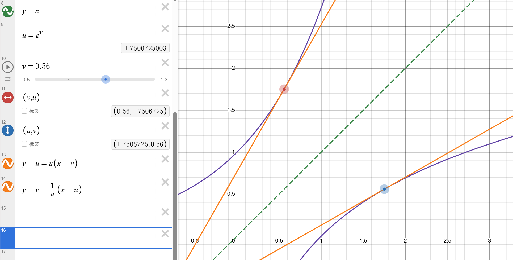

## 导数的定义
设 $f(x)$ 在 $x_0$ 附近有定义，如果当 $\Delta x\rightarrow0$ 时，$\frac{f(x_0+\Delta x)-f(x_0)}{\Delta x}$ 存在且确定，则称它是 $f(x)$ 在 $x_0$ 处的导数，记作：
$$ f'(x_0)=\lim_{\Delta x\rightarrow0}\frac{f(x_0+\Delta x)-f(x_0)}{\Delta x} $$   
这个 $f'(x)$ 称作 $f(x)$ 的导函数。  
$f'(x_0)$ 刻画了 $f(x)$ 在 $x_0$ 处的函数值变化率，也刻画了 $f(x)$ 在点 $(x_0,f(x_0))$ 处的切线斜率。  
所以有时我们用 $\frac{\mathrm dy}{\mathrm dx}$ 表示导数，$\mathrm d$ 代表瞬时变化量。  
## 导数的求法
### 导数运算法则
#### 四则运算
$ [f(x)+g(x)]'=f'(x)+g'(x) $  

$ [f(x)-g(x)]'=f'(x)-g'(x) $  

$ [f(x)g(x)]'=f'(x)g(x)+f(x)g'(x) $  

$\Large [\frac{f(x)}{g(x)}]'=\frac{f'(x)g(x)-f(x)g'(x)}{g^2(x)} $
#### 复合函数求导
$$ [f(g(x))]'=\lim_{\Delta x\rightarrow0}\frac{\Delta f(g(x))}{\Delta x}=\lim_{\Delta x\rightarrow0}\frac{\Delta f(g(x))}{\Delta g(x)}\cdot\lim_{\Delta x\rightarrow0}\frac{\Delta g(x)}{\Delta x}=f'(g(x))g(x) $$
这叫做链式法则。
#### 反函数求导
设 $f(x)$ 与 $g(x)$ 互为反函数，已知 $f'(x)$，如何求解 $g'(x)$？  
假设 $g(x)=y$，则有 $f(y)=x$，由于 $f(x)$ 和 $g(x)$ 的图像关于直线 $y=x$ 对称，则对称点处切线斜率应当互为倒数，所以 $g'(x)f'(y)=1$，故 $g'(x)\large=\frac1{f'(y)}=\frac1{f'(g(x))}$。  
放一个图帮助理解。  
{width="800"}  
可以看出，这两条橙色的切线斜率互为倒数。
### 部分基本初等函数的导数
先从定义出发。  

例 1：$f(x)=c$，$c$ 是一个常数，求 $f'(x)$。
???+ success "解法"
    $$ f'(x)=\lim_{\Delta x\rightarrow0}\frac{f(x+\Delta x)-f(x)}{\Delta x}=\frac{0}{\Delta x}=0 $$

例 2：$f(x)=x^n$，$n\in \mathbb N_+$，求 $f'(x)$。
???+ success "解法"
    由二项式定理，得：  
    $$ f'(x)=\lim_{\Delta x\rightarrow0}\frac{f(x+\Delta x)-f(x)}{\Delta x}=\lim_{\Delta x\rightarrow0}\frac{\mathrm C_n^1 x^{n-1}\Delta x+\mathrm C_n^2 x^{n-2}(\Delta x)^2+\cdots+\mathrm C_n^n (\Delta x)^n}{\Delta x} $$
    $$ =nx^{n-1}+\lim_{\Delta x\rightarrow0}[\mathrm C_n^2 x^{n-2}(\Delta x)+\cdots+\mathrm C_n^n (\Delta x)^{n-1}]=nx^{n-1} $$

例 3：$f(x)=\sin x$，求 $f'(x)$。
???+ success "解法"
    考虑和差化积。  
    $$ f'(x)=\lim_{\Delta x\rightarrow0}\frac{\sin(x+\Delta x)-\sin x}{\Delta x}=\lim_{\Delta x\rightarrow0}\frac{2\cos(x+\frac12\Delta x)\sin\frac{\Delta x}2}{\Delta x} $$
    根据 $\cos x$ 的连续性，$\lim_{\Delta x\rightarrow0}\cos(x+\frac12\Delta x)=\cos x$，而根据 $\large\frac{\sin\Delta x}{\Delta x}$ 在 $\Delta x\rightarrow0$ 时趋近 $1$（证明见大学数学 - 数学分析 B1 - 常用等价小量），有：  
    $$ f'(x)=\lim_{\Delta x\rightarrow0}\frac{2\cos(x+\frac12\Delta x)\sin\frac{\Delta x}2}{\Delta x}=2\cos x\cdot\lim_{\Delta x\rightarrow0}\frac{\sin\frac{\Delta x}2}{\Delta x}=\cos x\cdot\lim_{\Delta x\rightarrow0}\frac{\sin\frac{\Delta x}2}{\frac{\Delta x}2}=\cos x $$

例 4：$f(x)=\cos x$，求 $f'(x)$。  
???+ success "解法"
    仿照上例即可，答案为 $-\sin x$，证明留给读者。

例 5：$f(x)=\ln x$，求 $f'(x)$。  
???+ success "解法"
    $$ f'(x)=\lim_{\Delta x\rightarrow0}\frac{\ln(x+\Delta x)-\ln x}{\Delta x}=\lim_{\Delta x\rightarrow0}\frac{\ln\frac{x+\Delta x}x}{\Delta x}=\frac1x\cdot\lim_{\Delta x\rightarrow0}\frac{\ln(1+\frac{\Delta x}x)}{\frac{\Delta x}x} $$  

    根据 $\large\frac{\ln (1+\Delta x)}{\Delta x}$ 在 $\Delta x\rightarrow0$ 时趋近 $1$（证明见大学数学 - 数学分析 B1 - 常用等价小量），有：  
    $$ f'(x)=\frac1x\cdot\lim_{\Delta x\rightarrow0}\frac{\ln(1+\frac{\Delta x}x)}{\frac{\Delta x}x}=\frac1x $$
例 6：$f(x)=e^x$，求 $f'(x)$。